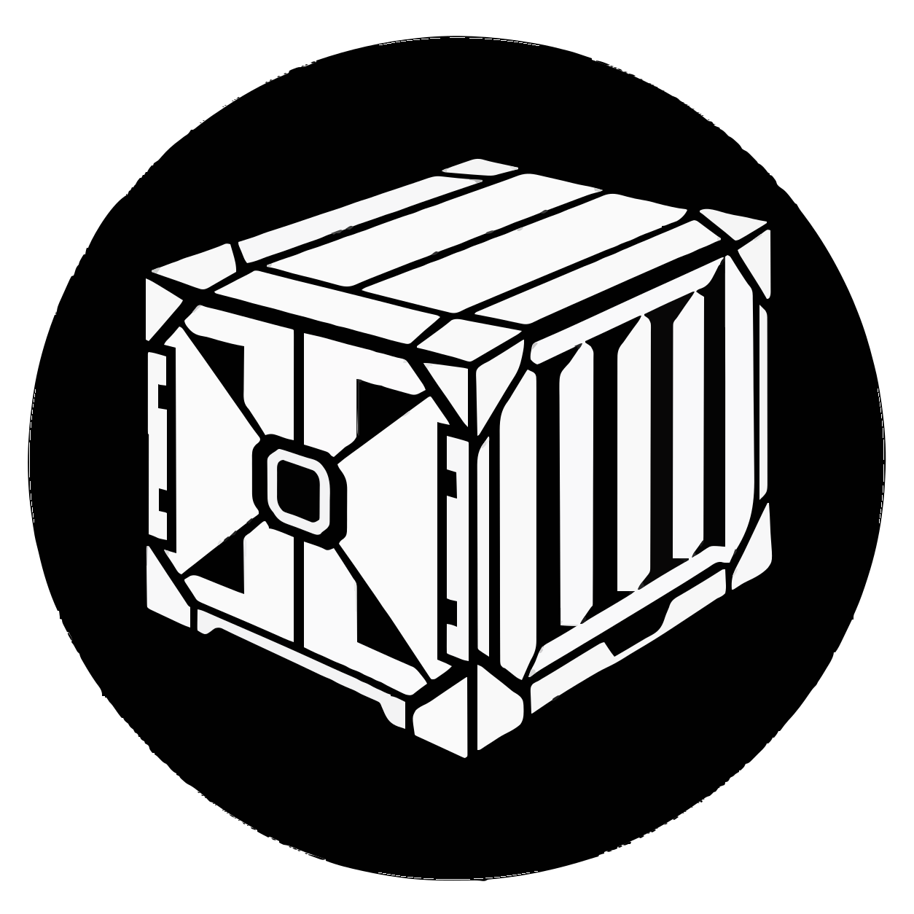

# Yougori

<p>
  <a href="https://yougori.com/"></a>
  &nbsp;&nbsp;
  <a href="https://discord.gg/Eqhf4Hq3AG"></a>
  &nbsp;&nbsp;
  <a href="https://x.com/withYougori"></a>
</p>

Create and manage containers, microVMs and virtual machines from one desktop workspace.

Yougori's original code is **open source under [AGPL-3.0-only](LICENSE)**,
with a **[separate paid commercial licensing option](COMMERCIAL_LICENSE.md)**
from Yougori LLC. Commercial use is allowed under AGPL when its conditions are
met; payment is not required just because a use is commercial. Third-party
components retain their own licenses, and earlier Apache grants remain valid.
See the [licensing guide](docs/licensing.md), [attribution notices](NOTICE)
and [source-distribution status](docs/compliance-status.md).

This branch is available to build from source. New installers will be linked
here after their matching application and third-party sources are published
and the built installers' license files are verified. Older September 10
installers are not covered by the current source inventory; see
[the recorded historical issues](docs/compliance-status.md#main-and-older-releases-still-require-follow-up).

The [source publication record](compliance/release.json) identifies the current
source-only release and checksums. Its ZIP contains the application source in
`bundle/yougori-application-source.tar.gz` and the matching third-party archives.


## Run from source

Start with Git, Node.js 24 LTS, Rust stable and the platform prerequisites: [Windows](docs/source-checkout.md#windows-desktop-prerequisites), [Ubuntu](docs/linux.md#build-from-source), or [macOS](docs/macos.md#first-build-on-the-borrowed-mac).

### Windows x64 — PowerShell

```powershell
git clone --branch staging https://github.com/Yougori/yougori.git
Set-Location yougori
rustup default stable-x86_64-pc-windows-msvc
npm ci
npm run cli:bundle
npm run desktop:dev
```

### Ubuntu 22.04+ x64 — Terminal

```bash
sudo apt update
sudo apt install -y build-essential pkg-config libwebkit2gtk-4.1-dev \
  libgtk-3-dev libayatana-appindicator3-dev librsvg2-dev patchelf \
  libssl-dev libxdo-dev qemu-system-x86 qemu-utils ovmf \
  openssh-client ca-certificates

git clone --branch staging https://github.com/Yougori/yougori.git
cd yougori
npm ci
npm run cli:bundle
npm run desktop:dev
```

### macOS 14+ — Terminal · development preview

```bash
git clone --branch staging https://github.com/Yougori/yougori.git
cd yougori
npm ci
npm run macos:setup
npm run cli:bundle
npm run desktop:dev
```

## Documentation

[Technical reference and troubleshooting](docs/technical-reference.md) · [CLI and AI agents](skills/yougori/references/cli.md) · [CUDA setup](runtime/cuda/README.md)

[Development, testing and releases](CONTRIBUTING.md)

[License](LICENSE) · [Third-party notices](src-tauri/resources/THIRD_PARTY_NOTICES.md)
