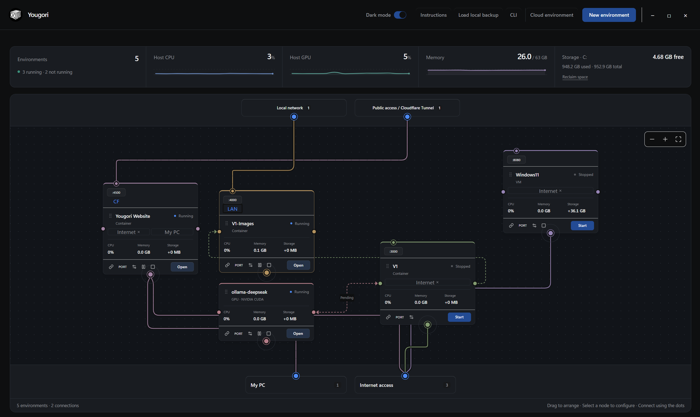

[](https://yougori.com/)

# Yougori

[yougori.com](https://yougori.com/) · [Discord](https://discord.gg/Eqhf4Hq3AG) · [X](https://x.com/withYougori)

Create and manage containers, microVMs and virtual machines from one desktop workspace.

Download Yougori from **[yougori.com](https://yougori.com/)**, use a direct download below, or [clone this GitHub repository](https://github.com/Yougori/yougori) and run it from source.

| Windows x64 | Ubuntu 22.04+ x64 |
| --- | --- |
| [Download EXE](https://yougori.com/downloads/Yougori_1.0.0_x64-setup-20260910.exe) · [Download MSI](https://yougori.com/downloads/Yougori_1.0.0_x64_en-US-20260910.msi) | [Download DEB](https://yougori.com/downloads/Yougori_1.0.0_amd64-20260910.deb) |



## Run from source

Start with Git, Node.js 24 LTS, Rust stable and the platform prerequisites: [Windows](docs/source-checkout.md#windows-desktop-prerequisites), [Ubuntu](docs/linux.md#build-from-source), or [macOS](docs/macos.md#first-build-on-the-borrowed-mac).

### Windows x64 — PowerShell

```powershell
git clone https://github.com/Yougori/yougori.git
Set-Location yougori
rustup default stable-x86_64-pc-windows-msvc
npm ci
npm run cli:bundle
npm run desktop:dev
```

### Ubuntu 22.04+ x64 — Terminal

```bash
sudo apt update
sudo apt install -y build-essential pkg-config libwebkit2gtk-4.1-dev \
  libgtk-3-dev libayatana-appindicator3-dev librsvg2-dev patchelf \
  libssl-dev libxdo-dev qemu-system-x86 qemu-utils ovmf \
  openssh-client ca-certificates

git clone https://github.com/Yougori/yougori.git
cd yougori
npm ci
npm run cli:bundle
npm run desktop:dev
```

### macOS 14+ — Terminal · development preview

```bash
git clone https://github.com/Yougori/yougori.git
cd yougori
npm ci
npm run macos:setup
npm run cli:bundle
npm run desktop:dev
```

## Documentation

[Technical reference and troubleshooting](docs/technical-reference.md) · [CLI and AI agents](skills/yougori/references/cli.md) · [CUDA setup](runtime/cuda/README.md)

[License](LICENSE) · [Third-party notices](src-tauri/resources/THIRD_PARTY_NOTICES.md)
